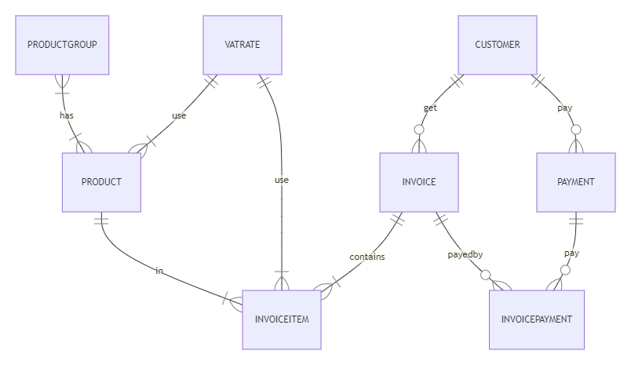
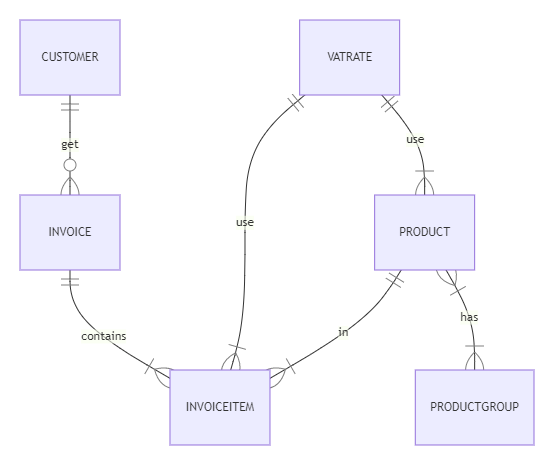

# Fakturowanie


Fakturowanie w wersji EFCore, na bazie fakturowania opisanego [kashiash/Invoice (github.com)](https://github.com/kashiash/Invoice)


docelowy model




zaczniemy jednak od wersji uproszczonej:




```

```


Grupa produktów:


```csharp
    [DefaultClassOptions]
    [DefaultProperty(nameof(Name))]
    public class ProductGroup: BaseObject
    {

        public virtual string Name { get; set; }
        public virtual string Description { get; set; }
        public virtual IList<Product> Products { get; set; } = new ObservableCollection<Product>();
    }
```

Stawki Vat:

```csharp
    [DefaultClassOptions]
    [NavigationItem("Others")]
    [DefaultProperty(nameof(Symbol))]
    public class VatRate :BaseObject
    {
        [FieldSize(3)]
       
        public virtual string Symbol { get; set; }
        [Precision(18, 2)]
        public virtual decimal RateValue { get; set; }
    }
```

Product

```csharp
     [DefaultClassOptions]
    [DefaultProperty(nameof(ShortName))]
    public class Product : BaseObject
    {
        [FieldSize(25)]
        public virtual string ShortName { get; set; }
        public virtual string Name { get; set; }
        public virtual string Description { get; set; }

        public virtual ProductGroup Group { get; set; }
        [Precision(18, 4)]
        public virtual decimal UnitPrice { get; set; }
        public virtual VatRate VatRate { get; set; }
        public virtual string Gtin { get; set; }
    }
```


i generator danych testowych:

```csharp
        var rates = ObjectSpace.GetObjectsQuery<VatRate>().ToList();
        if (rates.Count == 0)
        {
            rates.Add(NowaStawka("23%", 23M));
            rates.Add(NowaStawka("0%", 0M));
            rates.Add(NowaStawka("7%", 7M));
            rates.Add(NowaStawka("ZW", 0M));
        }
        List<ProductGroup> groups = new List<ProductGroup>();
        groups.Add(CreateProductGroup("Hardware"));
        groups.Add(CreateProductGroup("Software"));
        groups.Add(CreateProductGroup("Food"));
        groups.Add(CreateProductGroup("Vehicles"));


        var prodFaker = new Faker<Product>("pl")
        .CustomInstantiator(f => ObjectSpace.CreateObject<Product>())
        .RuleFor(o => o.Name, f => f.Commerce.ProductName())
        .RuleFor(o => o.Description, f => f.Commerce.ProductDescription())
        .RuleFor(o => o.ShortName, f => f.Commerce.Product())
        .RuleFor(o => o.UnitPrice, f => f.Random.Decimal(0.01M, 100M))
        .RuleFor(o => o.VatRate, f => f.PickRandom(rates))
        .RuleFor(o => o.Group, f => f.PickRandom(groups))
        .RuleFor(o => o.Gtin, f => f.Commerce.Ean13());

        prodFaker.Generate(100);

    private ProductGroup CreateProductGroup(string name)
    {
        ProductGroup group = ObjectSpace.FirstOrDefault<ProductGroup>(x => x.Name == name);
        if (group == null)
        {
            group = ObjectSpace.CreateObject<ProductGroup>();
            group.Name = name;
        }

        return group;
    }

    private VatRate NowaStawka(string symbol, decimal val)
    {
        var vat = ObjectSpace.FindObject<VatRate>(CriteriaOperator.Parse("Symbol = ?", symbol));
        if (vat == null)
        {
            vat = ObjectSpace.CreateObject<VatRate>();
            vat.Symbol = symbol;
            vat.RateValue = val;
        }
        return vat;
    }
```


teraz klienci:

```csharp
    [DefaultClassOptions]
    //Use this attribute to specify the caption format for the objects of the entity class.
    [ObjectCaptionFormat("{0:FullName}")]
    [DefaultProperty(nameof(FullName))]
    public class Customer: BaseObject
    {
        public virtual string ShortName { get; set; }

        public virtual string CompanyName { get; set; }
        public virtual string ExtendedName { get; set; }
        public virtual string VatID { get; set; }

        public virtual Address CompanyAddress { get; set; }
        public virtual Address CorrespondenceAddress { get; set; }

        //Use this attribute to specify the maximum number of characters that users can type in the editor of this property.
        [FieldSize(255)]
        public virtual String Email { get; set; }

        //Use this attribute to define a pattern that the property value must match.
        [RuleRegularExpression(@"(((http|https)\://)[a-zA-Z0-9\-\.]+\.[a-zA-Z]{2,3}(:[a-zA-Z0-9]*)?/?([a-zA-Z0-9\-\._\?\,\'/\\\+&amp;amp;%\$#\=~])*)|([a-zA-Z0-9._%+-]+@[a-zA-Z0-9.-]+\.[a-zA-Z]{2,6})", CustomMessageTemplate = @"Invalid ""Web Page Address"".")]
        public virtual string WebPageAddress { get; set; }

        //Use this attribute to specify the maximum string length allowed for this data field.
        [StringLength(4096)]
        public virtual string Notes { get; set; }

        [SearchMemberOptions(SearchMemberMode.Exclude)]
        public String FullName
        {
            get { return ObjectFormatter.Format(FullNameFormat, this, EmptyEntriesMode.RemoveDelimiterWhenEntryIsEmpty); }
        }

        [EditorBrowsable(EditorBrowsableState.Never)]
        public String DisplayName
        {
            get { return FullName; }
        }

        public virtual Segment Segment { get; set; }

        public static String FullNameFormat = "{FirstName} {MiddleName} {LastName}";
    }
    public enum Segment
    {
        Corporate = 2,
        Consumer = 7,
        [XafDisplayName("Home Office")]
        HomeOffice = 0,
        [XafDisplayName("Small Business")]
        SmallBusiness = 9
    }
```

Dane testowe:

```csharp

        var cusFaker = new Faker<Customer>("pl")
            .CustomInstantiator(f => ObjectSpace.CreateObject<Customer>())

            .RuleFor(o => o.Notes, f => f.Company.CatchPhrase())
            .RuleFor(o => o.CompanyName, f => f.Company.CompanyName())
            .RuleFor(o => o.Segment, f => f.PickRandom<Segment>())
            .RuleFor(o => o.Email, (f, c) => f.Internet.Email());
        cusFaker.Generate(10);
```

