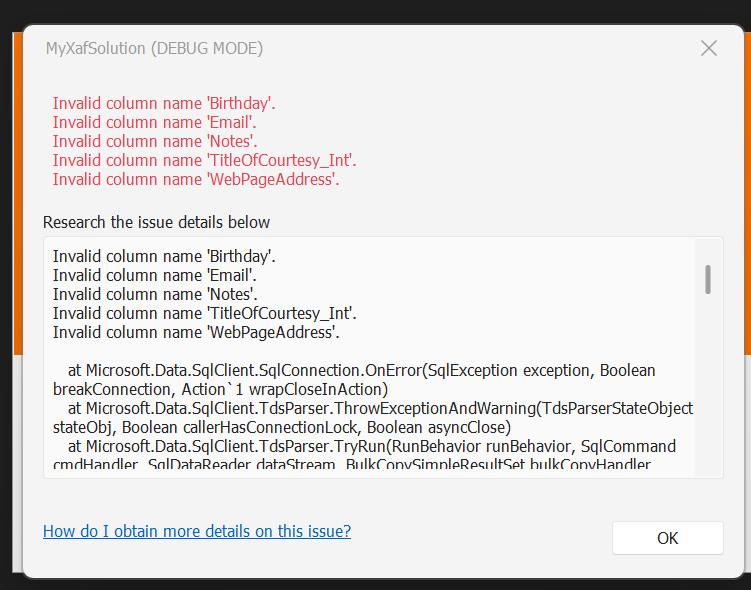
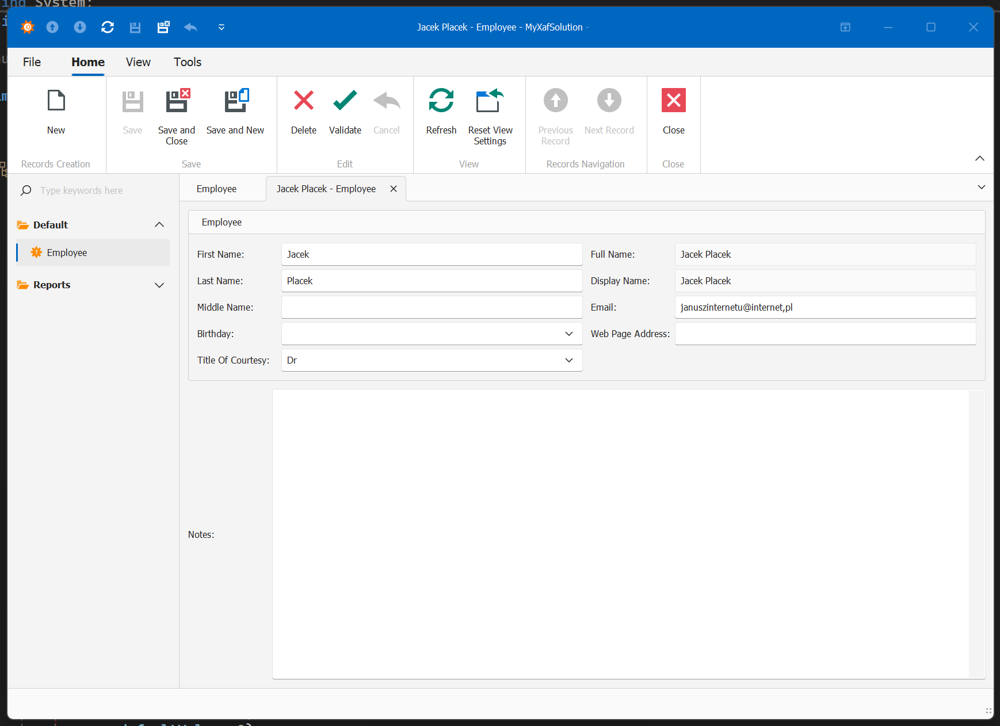
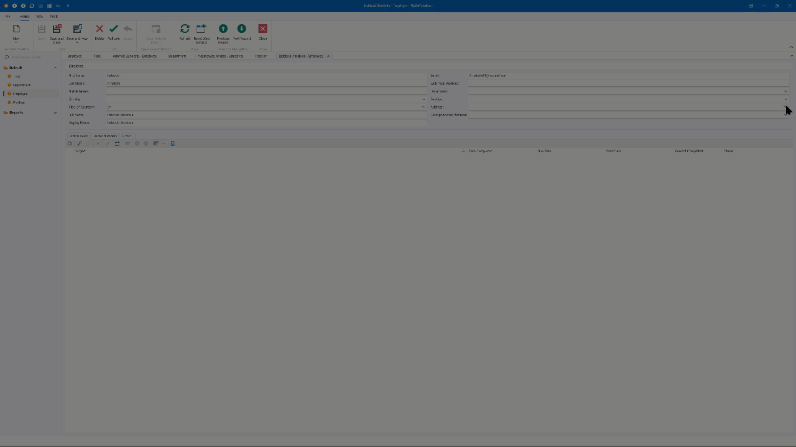
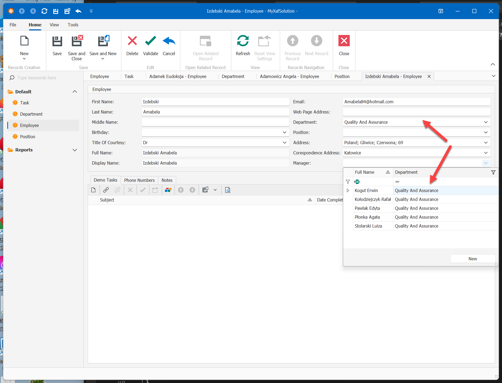
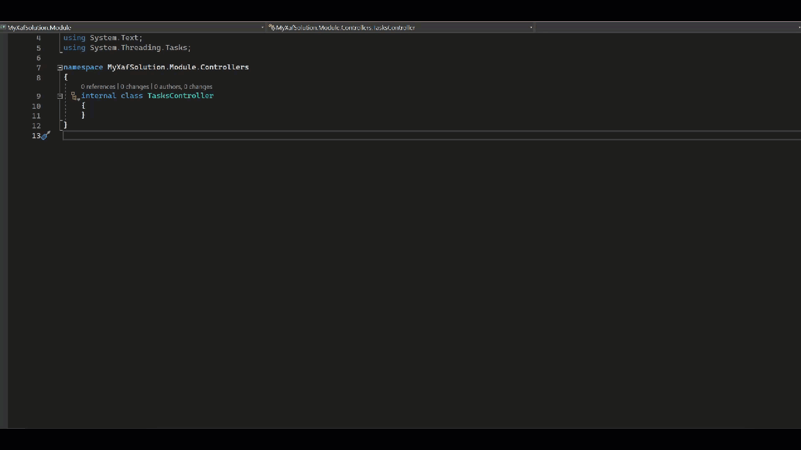
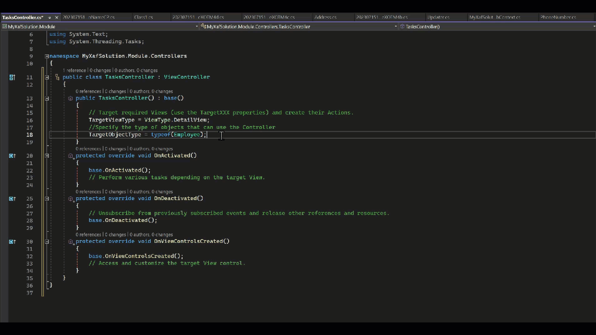

# Aplikacja XAF z EF Pierwsza krew


## Wstęp

Notatki z walki z tutorialem : 

[In-Depth .NET 6+ WinForms & Blazor UI Tutorial (Employee Manager) | eXpressApp Framework | DevExpress Documentation](https://docs.devexpress.com/eXpressAppFramework/402125/getting-started/in-depth-tutorial-blazor)


Z tego względu ze DevExpress rekomenduje przejście z XPO na EF, aktualizuję swoja wiedzę o XAF + EF


[Why We Recommend EF Core over XPO for New Development | eXpressApp Framework | DevExpress Documentation](https://docs.devexpress.com/eXpressAppFramework/404186/why-we-recommend-ef-core-over-xpo)


Generujemy jak zwykle projekt ale zamiast XPO wybieramy EF - tzn. nic nie musimy wybierać bo już jest wybrane. Nazywamy go np `MyXafSolution`


ustawiamy ścieżkę do bazy, jak masz sql w wersji developerskiej to zmień wpis 

```ini
connectionString="Integrated Security=SSPI;MultipleActiveResultSets=True;Data Source=(localdb)\mssqllocaldb;Initial Catalog=MyXafSolution" providerName="System.Data.SqlClient" />
  
```

na 

```ini
connectionString="Integrated Security=SSPI;MultipleActiveResultSets=True;Data Source=.;Initial Catalog=MyXafSolution" providerName="System.Data.SqlClient" />
```


wiecej o ustawianiu polaczenia do bazy tutaj: https://docs.devexpress.com/eXpressAppFramework/113155/business-model-design-orm/connect-an-xaf-application-to-a-database-provider


```
czyli zamien (localdb)\mssqllocaldb na localhost (lub . w windows)
```

potem definiujemy klasy EF np. :

```csharp

[DefaultClassOptions]
public class Employee : BaseObject
{

    public virtual String FirstName { get; set; }

    public virtual String LastName { get; set; }

    public virtual String MiddleName { get; set; }

}
```

jak widać zero filozofii, nawet prościej niż w xpo


uwaga jak się czepia o certyfikaty do bazy to trzeba dodać by ufał deweloperskim certyfikatom:

`;TrustServerCertificate=true`

```ini
connectionString="Integrated Security=SSPI;MultipleActiveResultSets=True;Data Source=.;Initial Catalog=DXApplicationEF;TrustServerCertificate=true" 
  
```


uwaga! to trzeba ustawić w *Blazor.Server w plik `appseting.json` oraz w  *Win `App.config`


## Aktualizacja bazy danych:

Instalujemy pierdolety potrzebne EF do aktualizacji bazy :

w package Manager console dla MySolution.Module instalujemy pakiety:


```powershell
Install-Package Microsoft.EntityFrameworkCore.Tools
```

 

```powershell
Update-Package Microsoft.EntityFrameworkCore.Tools
```

mozemy sprawdzic czy bangla: 


```powershell
Get-Help about_EntityFrameworkCore
```


proponuje teraz w VisualStudio wejść do menadżera pakietów i zaktualizować wszystko, żeby nie mieć konfliktów wersji szczególnie dl EFCore, które Microsoft aktualizuje częściej niz system Windows.

oczywiście można to zrobić w konsoli:

```powershell
 Update-Package
```


Szukamy w module wspólnym `MyXafSolutionEFCoreDbContext.cs`

i odkomentowujemy kod w metodzie, komentując jednocześnie lub usuwając wywolanie wyjątku:

```csharp
public MyXafSolutionEFCoreDbContext CreateDbContext(string[] args) {
//throw new InvalidOperationException("Make sure that the database connection string and connection provider are correct. After that, uncomment the code below and remove this exception.");
	var optionsBuilder = new DbContextOptionsBuilder<MyXafSolutionEFCoreDbContext>();
	optionsBuilder.UseSqlServer("Integrated Security=SSPI;Data Source=.;Initial Catalog=MyXafSolution");
	optionsBuilder.UseChangeTrackingProxies();
	optionsBuilder.UseObjectSpaceLinkProxies();
	return new MyXafSolutionEFCoreDbContext(optionsBuilder.Options);
}
```

następnie dodajemy/generujemy kod zarządzający wersjami:

```powershell
add-migration MyInitialMigrationName -StartupProject "MyXafSolution.Module" -Project "MyXafSolution.Module"
```


teraz generujemy aktualizacje bazy danych:

```
update-database -StartupProject "MyXafSolution.Module" -Project "MyXafSolution.Module"
```


jak zobaczycie taki straszny komuniukat:


```csharp
Microsoft.Data.SqlClient.SqlException (0x80131904): A connection was successfully established with the server, but then an error occurred during the login process. (provider: SSL Provider, error: 0 - Łańcuch certyfikatów został wystawiony przez urząd, którego nie jest zaufany.)

```

tzn ze tam co przed chwila odkomentowaliśmy trzeba tez dodać zaufanie do certyfikatów :


```csharp
optionsBuilder.UseSqlServer("Integrated Security=SSPI;Data Source=.;Initial Catalog=MyXafSolution;TrustServerCertificate=true");
```


## Modyfikacja modelu

rozbudowujemy nasza klase Employee o dodatkowe pola:


```cs

public class Employee : BaseObject
{

    public virtual String FirstName { get; set; }

    public virtual String LastName { get; set; }

    public virtual String MiddleName { get; set; }

    public virtual DateTime? Birthday { get; set; }

    //Use this attribute to hide or show the editor of this property in the UI.
    [Browsable(false)]
    public virtual int TitleOfCourtesy_Int { get; set; }

    //Use this attribute to exclude the property from database mapping.
    [NotMapped]
    public virtual TitleOfCourtesy TitleOfCourtesy { get; set; }

}
public enum TitleOfCourtesy
{
    Dr,
    Miss,
    Mr,
    Mrs,
    Ms
}
```


i uruchamiamy ponownie ...


wywaliło sie ... goście od DevExpress mają szczęście ze nie ma ich w pobliżu jednak w XPO bylo latwiej. Trzeba znów zrobić upgrade:

```
PM> add-migration MyInitialMigrationName -StartupProject "MyXafSolution.Module" -Project "MyXafSolution.Module"
Build started...
Build succeeded.

PM> update-database -StartupProject "MyXafSolution.Module" -Project "MyXafSolution.Module"
Build started...
Build succeeded.
No migrations were applied. The database is already up to date.
Done.
PM> 
```


POWYZSZA APLIAKCJA POWINNA DAC SIE URUCHOMIC !!!

Jak coo snie dziala to odsylam do oryginalnego tutoriala :

[Extend the Data Model | eXpressApp Framework | DevExpress Documentation](https://docs.devexpress.com/eXpressAppFramework/404256/getting-started/in-depth-tutorial-blazor/define-data-model-and-set-initial-data/define-data-model-and-set-initial-data-with-ef-core/extend-the-data-model?p=netframework)


```csharp
[DefaultClassOptions]
//Use this attribute to specify the caption format for the objects of the entity class.
[ObjectCaptionFormat("{0:FullName}")]
[DefaultProperty(nameof(FullName))]
public class Employee : BaseObject
{

...

    [SearchMemberOptions(SearchMemberMode.Exclude)]
    public String FullName
    {
        get { return ObjectFormatter.Format(FullNameFormat, this, EmptyEntriesMode.RemoveDelimiterWhenEntryIsEmpty); }
    }

    [EditorBrowsable(EditorBrowsableState.Never)]
    public String DisplayName
    {
        get { return FullName; }
    }

    public static String FullNameFormat = "{FirstName} {MiddleName} {LastName}";

    //Use this attribute to specify the maximum number of characters that users can type in the editor of this property.
    [FieldSize(255)]
    public virtual String Email { get; set; }

    //Use this attribute to define a pattern that the property value must match.
    [RuleRegularExpression(@"(((http|https)\://)[a-zA-Z0-9\-\.]+\.[a-zA-Z]{2,3}(:[a-zA-Z0-9]*)?/?([a-zA-Z0-9\-\._\?\,\'/\\\+&amp;amp;%\$#\=~])*)|([a-zA-Z0-9._%+-]+@[a-zA-Z0-9.-]+\.[a-zA-Z]{2,6})", CustomMessageTemplate = @"Invalid ""Web Page Address"".")]
    public virtual string WebPageAddress { get; set; }

    //Use this attribute to specify the maximum string length allowed for this data field.
    [StringLength(4096)]
    public virtual string Notes { get; set; }

}
```


oczywiscie nie zdziwcie sie ze :




znow urok EF:

```
add-migration MyInitialMigrationNameX1 -StartupProject "MyXafSolution.Module" -Project "MyXafSolution.Module"

update-database -StartupProject "MyXafSolution.Module" -Project "MyXafSolution.Module"
```


juz go nie lubie ....

uwaga nazwa migracji `MyInitialMigrationNameX1`musi byc unikalna, bo inaczej bedzi bład ze jest duplkat nazwy: 

```
add-migration MyInitialMigrationNameX1 -StartupProject "MyXafSolution.Module" -Project "MyXafSolution.Module"
```


i nasz peikny program powinien w winforms wygladac tak:




## Dane początkowe


W module wspolnym jest klasa do aktualizacji bazy danych o nazwie `Updater` a w niej metoda:  `UpdateDatabaseAfterUpdateSchema`


wykonywana jest ona przy kazdej aktualizacji bazy danych, mozemy tam dodac dane poczatkowe dla aplikacji :

```csharp
using MySolution.Module.BusinessObjects;
//...

public class Updater : DevExpress.ExpressApp.Updating.ModuleUpdater {
    //...
    public override void UpdateDatabaseAfterUpdateSchema() {
        base.UpdateDatabaseAfterUpdateSchema();

        Employee employeeMary = ObjectSpace.FirstOrDefault<Employee>(x => x.FirstName == "Mary" && x.LastName == "Tellitson");
        if(employeeMary == null) {
            employeeMary = ObjectSpace.CreateObject<Employee>();
            employeeMary.FirstName = "Mary";
            employeeMary.LastName = "Tellitson";
            employeeMary.Email = "tellitson@example.com";
            employeeMary.Birthday = new DateTime(1980, 11, 27);
        }

        ObjectSpace.CommitChanges(); //Uncomment this line to persist created object(s).
    }
}
```


powiązane linki, ktore moga byc przydatne:

[Data Seeding - EF Core | Microsoft Learn](https://learn.microsoft.com/en-us/ef/core/modeling/data-seeding)


można użyć generatora danych testowych https://github.com/bchavez/Bogus


Install-Package Bogus


```csharp
    public override void UpdateDatabaseAfterUpdateSchema()
    {
        base.UpdateDatabaseAfterUpdateSchema();

        var empFaker = new Faker<Employee>("pl")
            .CustomInstantiator(f => ObjectSpace.CreateObject<Employee>())
            .RuleFor(o => o.LastName, f => f.Person.FirstName)
            .RuleFor(o => o.FirstName, f => f.Person.LastName)
            .RuleFor(o => o.Email, (f, c) => f.Internet.Email());
        empFaker.Generate(100);
        ObjectSpace.CommitChanges(); //This line persists created object(s).
    }
```

tu przyklad dla innej klasy:

```csharp
            var cusFaker = new Faker<Customer>("pl")
                .CustomInstantiator(f => ObjectSpace.CreateObject<Customer>())

                .RuleFor(o => o.Notes, f => f.Company.CatchPhrase())
                .RuleFor(o => o.CustomerName, f => f.Company.CompanyName())
                .RuleFor(o => o.Segment, f => f.PickRandom<Segment>())
                .RuleFor(o => o.City, f => f.Address.City())
                .RuleFor(o => o.PostalCode, f => f.Address.ZipCode())
                .RuleFor(o => o.Street, f => f.Address.StreetName())
                .RuleFor(o => o.Phone, f => f.Person.Phone)
                .RuleFor(o => o.Email, (f, c) => f.Internet.Email());
            cusFaker.Generate(100);
            ObjectSpace.CommitChanges(); //This line persists created object(s).
```


## Relacja Many To Many


dodajemy liste zadan, Task jest zajete wiec uyjmy DemoTask


```csharp
using DevExpress.ExpressApp.Model;
using DevExpress.Persistent.Base;
using DevExpress.Persistent.BaseImpl.EF;
using DevExpress.ExpressApp.DC;
using System.ComponentModel.DataAnnotations.Schema;
using System.ComponentModel;

namespace MySolution.Module.BusinessObjects
{
    [DefaultClassOptions]
    //Use this attribute to define the name of the objects of this type in the user interface.
    [ModelDefault("Caption", "Task")]
    public class DemoTask : BaseObject
    {
        public virtual DateTime? DateCompleted { get; set; }

        public virtual String Subject { get; set; }

        [FieldSize(FieldSizeAttribute.Unlimited)]
        public virtual String Description { get; set; }

        public virtual DateTime? DueDate { get; set; }

        public virtual DateTime? StartDate { get; set; }

        public virtual int PercentCompleted { get; set; }

        private TaskStatus status;

        public virtual TaskStatus Status
        {
            get { return status; }
            set
            {
                status = value;
                if (isLoaded)
                {
                    if (value == TaskStatus.Completed)
                    {
                        DateCompleted = DateTime.Now;
                    }
                    else
                    {
                        DateCompleted = null;
                    }
                }
            }
        }

        [Action(ImageName = "State_Task_Completed")]
        public void MarkCompleted()
        {
            Status = TaskStatus.Completed;
        }

        private bool isLoaded = false;
        public override void OnLoaded()
        {
            isLoaded = true;
        }

     }
     public enum TaskStatus
     {
         [ImageName("State_Task_NotStarted")]
         NotStarted,
         [ImageName("State_Task_InProgress")]
         InProgress,
         [ImageName("State_Task_WaitingForSomeoneElse")]
         WaitingForSomeoneElse,
         [ImageName("State_Task_Deferred")]
         Deferred,
         [ImageName("State_Task_Completed")]
         Completed
     }
}
```


i relacje do pracownikow i odwrotna relacje w pracownikach:


```csharp

    public class DemoTask : BaseObject
    {
        // ...
        public virtual IList<Employee> Employees { get; set; } = new ObservableCollection<Employee>();

    }

```


```csharp
public class Employee : BaseObject {
    public Employee() {
        //...
        public virtual IList<DemoTask> DemoTasks { get; set; } = new ObservableCollection<DemoTask>();
    }
    //...
}
```


niesmiertelna migracja

```
add-migration MyInitialMigrationNameXMTM -StartupProject "MyXafSolution.Module" -Project "MyXafSolution.Module"

update-database -StartupProject "MyXafSolution.Module" -Project "MyXafSolution.Module"
```


## Relacja One To Many

dodajemy kolejną klasę:

```csharp
using DevExpress.Persistent.Base;
using DevExpress.Persistent.BaseImpl.EF;
using System.ComponentModel;

namespace MySolution.Module.BusinessObjects
{
    [DefaultClassOptions]
    [DefaultProperty(nameof(Title))]
    public class Department : BaseObject
    {
        public virtual string Title { get; set; }

        public virtual string Office { get; set; }

    }
}
```


rejestrujemy ja w dbcontext:


```csharp
public class MyXafSolutionEFCoreDbContext : DbContext {
    //...
    public DbSet<Department> Departments { get; set; }
}
```

 w pracowniku dodajemy powiązanie do Departamnetu:


```csharp
//...
public class Employee : BaseObject {
    //...
    public virtual Department Department { get; set; }
}
```

 i w departamentach dodajemy pracowników:

```csharp
// ...
using System.Collections.ObjectModel;
//...
public class Department : baseObject {
    //..
    public virtual IList<Employee> Employees { get; set; } = new ObservableCollection<Employee>();
}
```


stanadard z migracją: 

```
 add-migration MyInitialMigrationNameXOTM -StartupProject "MyXafSolution.Module" -Project "MyXafSolution.Module"

 update-database -StartupProject "MyXafSolution.Module" -Project "MyXafSolution.Module"

```


teraz dodajmy klientom liste numerow telefonicznych: (sprobuj zrobic to sam.)


1. zakladamy klase phone numbers
2. dodajemy powiaznie w phone do pracownika
3. w pracownikach dodajemy kolekcje  telefonow
4. dopisujemy phonenumbers do dbcontext.cs
5. migracja bazy 

1.

```csharp
[DefaultProperty(nameof(Number))]
public class PhoneNumber : BaseObject
{

    public virtual String Number { get; set; }

    public virtual String PhoneType { get; set; }

    public override String ToString()
    {
        return Number;
    }

}
```


2.

```csharp
[DefaultProperty(nameof(Number))]
public class PhoneNumber : BaseObject
{

   ...


    public virtual Employee Employee {get; set;}
}
```


3.

```csharp
public class Employee : BaseObject
{
    ...

	public virtual IList<PhoneNumber> PhoneNumbers { get; set; } = new ObservableCollection<PhoneNumber>();

}
```


4.

```csharp
public class MyXafSolutionEFCoreDbContext : DbContext {
	public MyXafSolutionEFCoreDbContext(DbContextOptions<MyXafSolutionEFCoreDbContext> options) : base(options) {
	}
    ...
    public DbSet<PhoneNumber> PhoneNumbers { get; set; }
    ...
    }
}
```

5.

```powershell
PM> add-migration MyInitialMigrationNameXOTM3 -StartupProject "MyXafSolution.Module" -Project "MyXafSolution.Module"

PM> update-database -StartupProject "MyXafSolution.Module" -Project "MyXafSolution.Module"
```


Dodajemy klase Stanowisko :

```csharp

    [DefaultClassOptions]
    [DefaultProperty(nameof(Title))]
    public class Position : BaseObject
    {
        public virtual string Title { get; set; }
    }

```

rejestrujemy tą klasę:


```csharp
public class MySolutionEFCoreDbContext : DbContext {
    //...
    public DbSet<Position> Positions { get; set; } 
}
```


i dodajemy ją w pracowniku:


```csharp
//...
using System.Collections.ObjectModel;

namespace MySolution.Module.BusinessObjects;

[DefaultClassOptions]
public class Employee : BaseObject {
    //...
    public virtual Position Position { get; set; }
}
```


w Updater.cs dodajmy kod ktory bedzie dodawal nam dzialy i stanowiska i przypisywal je do nowodanych pracownikow 


```csharp
        Department sales = ObjectSpace.FirstOrDefault<Department>(x => x.Title == "Sales");
        if (sales == null)
        {
            sales = ObjectSpace.CreateObject<Department>();
            sales.Title = "Developer";
        }
        Department quality = ObjectSpace.FirstOrDefault<Department>(x => x.Title == "Quality And Assurance");
        if (quality == null)
        {
            quality = ObjectSpace.CreateObject<Department>();
            quality.Title = "Quality And Assurance";
        }
        Department randd = ObjectSpace.FirstOrDefault<Department>(x => x.Title == "Research And Development");
        if (randd == null)
        {
            randd = ObjectSpace.CreateObject<Department>();
            randd.Title = "Research And Development";
        }

        List<Department> departments = new List<Department> { randd, quality, sales };


        Position developer = ObjectSpace.FirstOrDefault<Position>(x => x.Title == "Developer" );
        if (developer == null)
        {
            developer = ObjectSpace.CreateObject<Position>();
            developer.Title = "Developer";
        }

        Position manager = ObjectSpace.FirstOrDefault<Position>(x => x.Title == "Manager");
        if (manager == null)
        {
            manager = ObjectSpace.CreateObject<Position>();
            manager.Title = "Manager";
        }

        Position tester = ObjectSpace.FirstOrDefault<Position>(x => x.Title == "Tester");
        if (tester == null)
        {
            tester = ObjectSpace.CreateObject<Position>();
            tester.Title = "tester";
        }

        List<Position> positions = new List<Position> { developer,manager , tester };

        var empFaker = new Faker<Employee>("pl")
            .CustomInstantiator(f => ObjectSpace.CreateObject<Employee>())
            .RuleFor(o => o.LastName, f => f.Person.FirstName)
            .RuleFor(o => o.FirstName, f => f.Person.LastName)
            .RuleFor(o => o.TitleOfCourtesy, f => f.PickRandom<TitleOfCourtesy>())
            .RuleFor(o => o.Email, (f, c) => f.Person.Email)

            .RuleFor(o=> o.Postion, f=> f.PickRandom(positions))
            .RuleFor(o => o.Department, f => f.PickRandom(departments))
        ;
        empFaker.Generate(10);
        ObjectSpace.CommitChanges(); //This line persists created object(s).
```


teraz dodajemy adresy:


```csharp
using DevExpress.Persistent.Base;
using DevExpress.Persistent.BaseImpl.EF;
using System.ComponentModel;

namespace MyXafSolution.Module.BusinessObjects;

[DefaultProperty(nameof(FullAddress))]
public class Address : BaseObject
{
    private const string defaultFullAddressFormat = "{Country}; {StateProvince}; {City}; {Street}; {ZipPostal}";

    public virtual String Street { get; set; }

    public virtual String City { get; set; }

    public virtual String StateProvince { get; set; }

    public virtual String ZipPostal { get; set; }

    public virtual String Country { get; set; }

    public String FullAddress
    {
        get { return ObjectFormatter.Format(defaultFullAddressFormat, this, EmptyEntriesMode.RemoveDelimiterWhenEntryIsEmpty); }
    }
}
```


a w pracownikach dodajemy adres glowny i korespondencyjny:

    public virtual Address Address { get; set; }
    public virtual Address CorespondenceAddress { get; set; }

}




*Do tych adresów wrocimy niedlugo jak bede omawial rodzaje osadzenia podrzędnego view w detailview*


##  jak zaimplementować właściwości, których wartości zależą od innych właściwości.

W tym celu dodaj nową właściwość Manager do klasy Employee. Edytor dla tej właściwości wyświetla listę menedżerów, którzy pracują w tym samym dziale.


```csharp
using DevExpress.ExpressApp.DC;
//...
public class Employee : BaseObject {
    //...
    public virtual Employee Manager { get; set; }
}
```

a nastepnie dodajemy mu trybut filrujący:

```csharp
using DevExpress.ExpressApp.DC;
//...
public class Employee : BaseObject {
    //...
    [DataSourceProperty("Department.Employees", DataSourcePropertyIsNullMode.SelectAll), DataSourceCriteria("Position.Title = 'Manager'")]
    public virtual Employee Manager { get; set; }
}
// ...
```


W tym kodzie, atrybut **DataSourceProperty** akceptuje dwa parametry: **dataSourceProperty** i **mode**.

Parametr **dataSourceProperty** to wartość łańcuchowa, która określa nazwę właściwości kolekcji używanej jako źródło danych dla List View wyświetlanej w Lookup Property Editor. W tym samouczku ustawiasz ten parametr na "Department.Employees".

Parametr **mode** jest opcjonalny. Określa, jak elementy wyszukiwania są generowane, jeśli aplikacja nie może znaleźć żadnych elementów na podanej ścieżce. W tym samouczku ustawiasz go na SelectAll.

Możesz również ustawić go na SelectNothing lub CustomCriteria. W przypadku tego ostatniego, musisz również użyć parametru **DataSourcePropertyIsNullCriteria**, aby określić kryteria filtrowania List View przez Lookup Property Editor docelowej właściwości.

Atrybut **DataSourceCriteria** ogranicza elementy edytora wyszukiwania Manager do określonych obiektów. Dzięki filtrowi "Position.Title = 'Manager'", edytor wyszukiwania wyświetla tylko obiekty Employee, których wartość właściwości Position to "Manager".

Dodaj migrację i zaktualizuj bazę danych. Szczegółowe informacje znajdziesz w następnym rozdziale: Użyj DBMS: Konfiguracja migracji.

Uruchom aplikację i dokonaj następujących zmian (jak masz wpisane generowanie danych początkowych, to juz takie wpisy masz, ale dla latwiejszego zrozumienia i tak warto je uzupelnic):

Dodaj obiekt Department (na przykład "Development").
Dodaj wiele obiektów Position (na przykład "Manager", "Developer", "QA").
Dodaj wiele obiektów Employee z ustawioną właściwością Department na "Development".
Ustaw właściwość Position dla dwóch obiektów Employee na "Manager".
Ustaw właściwość Position dla pozostałych obiektów Employee na "Developer".
Utwórz nowy obiekt Employee. W widoku Employee Detail ustaw właściwość Department i rozwij edytor wyszukiwania Manager. Zauważ, że wyświetla tylko managerów z określonego działu.




inny sposób filtrowania jest opisany tutaj: https://docs.devexpress.com/eXpressAppFramework/112681/filtering/in-list-view/how-to-implement-cascading-filtering-for-lookup-list-views


## Obliczane właściwości.

W tym celu dodaj klasę Payment jako encję z następującymi właściwościami:

Rate (właściwość trwała)
Hours (właściwość trwała)
Amount (właściwość nieperystentna, obliczana: Amount = Rate * Hours)


```csharp

[DefaultClassOptions]
public class Payment : BaseObject
{
    //Use this attribute to specify the display format pattern for the property value.
    [ModelDefault("DisplayFormat", "{0:c}")]
    public virtual double Rate { get; set; }
    public virtual double Hours { get; set; }

    //Use this attribute to exclude the property from database mapping.
    [NotMapped]
    [ModelDefault("DisplayFormat", "{0:c}")]
    public double Amount
    {
        get { return Rate * Hours; }
    }

}
```

zarejestruj nową klasę :

```csharp
public class MySolutionEFCoreDbContext : DbContext {
    //...
    public DbSet<Payment> Payments { get; set; }
}
```

przeprowadź migracje  i uruchom program


##  SimpleAction - przyciski, które wykonują niestandardowy kod po kliknięciu przez użytkownika.

Poniższe instrukcje pokazują, jak dodać przycisk "Clear tasks" do widoku szczegółów pracownika. Po kliknięciu tego przycisku wyczyszczone zostaną wszystkie śledzone zadania wybranego pracownika.

**Uwaga przed kolejnymi krokami upewnij się ze masz zainstalowane CodeRush w VisualStudio** . Więcej o skrótach CodeRush [XAF Templates | CodeRush | DevExpress Documentation](https://docs.devexpress.com/CodeRushForRoslyn/403133/coding-assistance/code-templates/xaf-templates)

w Module wspólnym w katalogu `Controllers` dodajmy nowa klasę i nazwijmy ją `TasksController`

skopiujmy do schowka nazwę **TaskControler**, skasujmy wygenerowaną definicje klasy i wpiszmy **xcv** + spacja następnie zmieńmy nazwę zaproponowanej klasy na ta co mamy w schowku :CtrlV i Enter :



włala ... mamy definicje kontrolera.

*Na stronie devexpres przy tutorialu mamy inna metode, ktorą tez warto znać :*

*[Add a Simple Action | eXpressApp Framework | DevExpress Documentation](https://docs.devexpress.com/eXpressAppFramework/402157/getting-started/in-depth-tutorial-blazor/add-actions-menu-commands/add-a-simple-action)*


teraz musimy wskazać ze ten kontroler ma być wywoływany na `DetailView` tylko dla klasy `Employee`

```csharp
    public class TasksController : ViewController
    {
        public TasksController() : base()
        {
            // Target required Views (use the TargetXXX properties) and create their Actions.
            TargetViewType = ViewType.DetailView;
            //Specify the type of objects that can use the Controller
            TargetObjectType = typeof(Employee);
        }
        ...
    }
```

Jeśli nie określisz właściwości `TargetObjectType`, aplikacja wyświetli akcje kontrolera dla wszystkich widoków szczegółowych.

PORADA

Możesz również utworzyć ogólny obiekt `ViewController<ViewType>` lub `ObjectViewController<ViewType, ObjectType>` i określić typ docelowy jako parametr `ViewType`. Aby uzyskać więcej informacji na temat dostosowywania funkcjonalności kontrolera, odwołaj się do następującego tematu: Definiowanie zakresu kontrolerów i akcji. https://docs.devexpress.com/eXpressAppFramework/113103/ui-construction/controllers-and-actions/define-the-scope-of-controllers-and-actions

Dodaj nową akcję do kontrolera oraz obsługę zdarzenia Execute dla tej akcji. Oczywiście użyjemy do tego skrótów CodeRush:

umieśćmy kursor w konstruktorze kontrolera i wpiszmy **xas** + Spacja:



Uwaga: definiując akcje należy podać jej unikalna nazwę - inaczej podczas uruchomienia aplikacji dostaniemy info ze nazwy sa zdublowane. W małych projektach wystarczy, że ponazywamy te akcje "na sztywno" i bedziemy pamietac jakie nazwy nadalismy. Jednak w dużych warto zadbać o to by nie musieć miec tych nazw w glowie i pilnowac ich unikalnosci - stad wyrażenie `$"{GetType().FullName}{nameof(clearTaskAction)}"`, ono zapewni nam unikalność nazw wszystkich akcji


```csharp
  clearTaskAction = new SimpleAction(this, $"{GetType().FullName}{nameof(clearTaskAction)}", PredefinedCategory.View); 
```


resztę musimy dopisac recznie: 

```csharp
//definicja akcji:
clearTaskAction = new SimpleAction(this,
    $"{GetType().FullName}{nameof(clearTaskAction)}", PredefinedCategory.View) {
    //Specify the Action's button caption.
    Caption = "Clear tasks",
    //Specify the confirmation message that pops up when a user executes an Action.
    ConfirmationMessage = "Are you sure you want to clear the Tasks list?",
    //Specify the icon of the Action's button in the interface.
     ImageName = "Action_Clear"
 };
 clearTaskAction.Execute += clearTaskAction_Execute;

// kod czyszczący zadania:
private void clearTaskAction_Execute(object sender, SimpleActionExecuteEventArgs e)
{
   while (((Employee)View.CurrentObject).DemoTasks.Count > 0)
   {
      ((Employee)View.CurrentObject).DemoTasks.Remove(((Employee)View.CurrentObject).DemoTasks[0]);
      ObjectSpace.SetModified(View.CurrentObject, 		       
             View.ObjectTypeInfo.FindMember(nameof(Employee.DemoTasks)));
   }
}
```


## Parametrized Action

Ta lekcja wyjaśnia, jak dodać akcję z parametrem. Akcja z parametrem wyświetla edytor, który umożliwia użytkownikom wprowadzenie wartości parametru przed wykonaniem akcji.

Poniższe instrukcje pokazują, jak dodać akcję, która wyszukuje obiekt `DemoTask` na podstawie wartości właściwości `Subject` i wyświetla widok szczegółów znalezionego obiektu.

tworzymy klasę o nazwie `FindBySubjectController` (skróty **xcv** oraz **xap** są naszymi przyjaciółmi):


```csharp
public class FindBySubjectController : ViewController
{
   ParametrizedAction findBySubjectAction;
   public FindBySubjectController() : base()
    {
       findBySubjectAction = new ParametrizedAction(this,
                  $"{GetType().FullName}{nameof(findBySubjectAction)}",
                  PredefinedCategory.View , typeof(string));
       
       findBySubjectAction.Execute += findBySubjectAction_Execute;  
     }
    ..
}
```


oraz kod wykoinywany po kliknieciu:

```csharp
private void findBySubjectAction_Execute(object sender, ParametrizedActionExecuteEventArgs e)
{
    var objectType = ((ListView)View).ObjectTypeInfo.Type;
    IObjectSpace objectSpace = Application.CreateObjectSpace(objectType);
    string paramValue = e.ParameterCurrentValue as string;
    object obj = objectSpace.FirstOrDefault<DemoTask>(task => task.Subject.Contains(paramValue));
    if (obj != null)
    {
        DetailView detailView = Application.CreateDetailView(objectSpace, obj);
        detailView.ViewEditMode = ViewEditMode.Edit;
        e.ShowViewParameters.CreatedView = detailView;
    }
}
```


W XAF, używasz Object Space do zapytań i aktualizacji obiektów trwałych. Wywołaj statyczną metodę XafApplication.CreateObjectSpace, aby utworzyć Object Space.

Użyj metody `IObjectSpace.FirstOrDefault<ObjectType>`, aby znaleźć obiekt typu DemoTask. Metoda ta ma następujący parametr:

- Wyrażenie lambda do wyszukiwania obiektu.

Tworzenie nowego widoku
Aby wyświetlić znaleziony obiekt w osobnym widoku szczegółów:

- Wywołaj metodę XafApplication.CreateDetailView, aby utworzyć widok.
- Przypisz widok do właściwości `e.ShowViewParameters.CreatedView` parametru zdarzenia.

PORADA

Możesz zainicjować właściwość `ShowViewParameters` w obsłudze zdarzenia Execute dowolnej akcji dowolnego typu. Dzięki temu zawsze można wyświetlać widok po wykonaniu akcji.

Aby uzyskać więcej informacji na temat wyświetlania widoku w osobnym oknie, odwołaj się do następującego tematu: Sposoby wyświetlania widoku. [Ways to Show a View | eXpressApp Framework | DevExpress Documentation](https://docs.devexpress.com/eXpressAppFramework/112803/ui-construction/views/ways-to-show-a-view/ways-to-show-a-view)


## Popup Window Action


Dodajmy nową klasę `Note`:

```csharp
using DevExpress.ExpressApp.DC;
using DevExpress.Persistent.Base;
using System.ComponentModel;
using System.ComponentModel.DataAnnotations;

namespace MySolution.Module.BusinessObjects;

[DefaultProperty(nameof(Text))]
[ImageName("BO_Note")]
public class Note {

    [Key, Browsable(false)]
    [DevExpress.ExpressApp.Data.Key]
    [VisibleInDetailView(false), VisibleInListView(false), VisibleInLookupListView(false)]
    public virtual Guid ID { get; set; }
    public virtual String Author { get; set; }
    public virtual DateTime? DateTime { get; set; }

    [FieldSize(FieldSizeAttribute.Unlimited)]
    public virtual String Text { get; set; }
}
```


utwórzmy kontroler *PopupNotesController* (skróty codeRush xcv oraz xapw)


```csharp

public PopupNotesController() : base()
{
    TargetObjectType = typeof(DemoTask);
    TargetViewType = ViewType.DetailView;

    showNotesAction = new PopupWindowShowAction(this, $"{GetType().FullName}{nameof(showNotesAction)}",
            PredefinedCategory.View)
    {
        Caption = "Show Notes"
    };
    showNotesAction.Execute += showNotesAction_Execute;
    showNotesAction.CustomizePopupWindowParams += showNotesAction_CustomizePopupWindowParams;
            
}
..
}
```


```csharp
private void ShowNotesAction_CustomizePopupWindowParams(object sender, CustomizePopupWindowParamsEventArgs e) {
     //Create a List View for Note objects in the pop-up window.
     e.View = Application.CreateListView(typeof(Note), true);
}
```


Dodaj obsługę zdarzenia `Execute` dla akcji `ShowNotesAction`. To zdarzenie występuje, gdy użytkownik kliknie OK w oknie pop-up. Kod obsługujący zdarzenie dodaje wartość właściwości `Note.Text` do wartości właściwości `Task.Description`. 

```csharp
private void showNotesAction_Execute(object sender, PopupWindowShowActionExecuteEventArgs e)
{
    DemoTask task = (DemoTask)View.CurrentObject;
    foreach (Note note in e.PopupWindowViewSelectedObjects)
    {
        if (!string.IsNullOrEmpty(task.Description))
        {
            task.Description += Environment.NewLine;
        }
        // Add selected note texts to a Task's description
        task.Description += note.Text;
    }
    View.ObjectSpace.CommitChanges();
}
```


w Updater dodajmy kod ktory wygeneruje nam nieco zadan:

```csharp
var faker = new Faker<DemoTask>()
.CustomInstantiator(f => ObjectSpace.CreateObject<DemoTask>())
.RuleFor(t => t.DateCompleted, f => f.Date.Past())
.RuleFor(t => t.Subject, f => f.Company.Random.Word())
.RuleFor(t => t.Description, f => f.Lorem.Paragraph())
.RuleFor(t => t.DueDate, f => f.Date.Future())
.RuleFor(t => t.StartDate, (f,t) => f.Date.Between(t.DueDate.Value.AddDays(-7), t.DueDate.Value))
.RuleFor(t => t.PercentCompleted, f => f.Random.Int(0, 100))
.RuleFor(t=> t.Employees, f=> empFaker.Generate(5))
    
.RuleFor(t => t.Status, f => f.PickRandom<TaskStatus>());

var tasks = faker.Generate(100);
// powiąższmy zadania z klientami
foreach (var task in tasks)
{
    task.Employees.Add(GetRandomElement(emps));
 	task.Employees.Add(GetRandomElement(emps));
    task.Employees.Add(GetRandomElement(emps));
    task.Employees.Add(GetRandomElement(emps));
}
```


potrzebna funkcja zwracajaca losowy element z listy:

    private static T GetRandomElement<T>(List<T> emps)
    {
        Random random = new Random();
        var emp = emps.OrderBy(x => random.Next()).Take(1).FirstOrDefault();
        return emp;
    }


## Single Choice Action


W tej lekcji zaimplementujemy nowy kontroler widoku (View Controller) z akcją `SingleChoiceAction`. Ta akcja umożliwi użytkownikom wybór wartości dla właściwości `Task.Priority` i `Task.Status`.

Tworzymy kontroler o nazwie *TaskActionsController* (code rush: **xcv**, **xac**) i ograniczamy go do typu `DemoTask`


```csharp
public class TaskActionsController : ViewController
{
    public TaskActionsController() : base()
    {
        TargetObjectType = typeof(DemoTask);
    }
    ...
}        
```


```csharp
public partial class TaskActionsController : ViewController {
   private ChoiceActionItem setPriorityItem;
   private ChoiceActionItem setStatusItem;
   public TaskActionsController() {
      // ...
      setPriorityItem = 
         new ChoiceActionItem(CaptionHelper.GetMemberCaption(typeof(DemoTask), "Priority"), null);
      SetTaskAction.Items.Add(setPriorityItem);
      FillItemWithEnumValues(setPriorityItem, typeof(Priority));

      setStatusItem = 
         new ChoiceActionItem(CaptionHelper.GetMemberCaption(typeof(DemoTask), "Status"), null);
      SetTaskAction.Items.Add(setStatusItem);
      FillItemWithEnumValues(setStatusItem, typeof(BusinessObjects.TaskStatus));

   }
   private void FillItemWithEnumValues(ChoiceActionItem parentItem, Type enumType) {
        EnumDescriptor ed = new EnumDescriptor(enumType);
        foreach(object current in ed.Values) {
            ChoiceActionItem item = new ChoiceActionItem(ed.GetCaption(current), current);
            item.ImageName = ImageLoader.Instance.GetEnumValueImageName(current);
            parentItem.Items.Add(item);
        }
    }
}
```

Przykład kodu powyżej organizuje elementy z kolekcji Items akcji jako drzewo:

Poziom główny zawiera elementy, których podpisy odpowiadają nazwom właściwości DemoTask.Priority i DemoTask.Status. Obiekt CaptionHelper zwraca podpisy elementów.
Poziom zagnieżdżony zawiera wartości enumeracji Priority i Status. Obiekt EnumDescriptor zwraca podpisy elementów.

Jeśli wypełniasz kolekcję `ChoiceActionBase.Items` w konstruktorze kontrolera, jak pokazano w powyższym kodzie, możesz użyć w Model Editorze węzła ActionDesign | Actions | <Action> | ChoiceActionItems, aby ustawić nazwę obrazka, skrót klawiaturowy i zlokalizowany podpis dla dodanych elementów.

Jeśli wypełniasz kolekcję `Items` w obsłudze zdarzenia `Controller.Activated`, Model Editor nie wczytuje elementów. W tym przypadku będziesz musiał ręcznie zdefiniować elementy w Model Editorze lub dynamicznie wypełnić je programowo za pomocą innych metod, na przykład osobnej metody lub odczytu z innych źródeł konfiguracyjnych.


W tym samouczku wartości enumeracji mają atrybuty ImageNameAttribute, które służą do ustawienia obrazów dla tych wartości w interfejsie użytkownika.

XAF dostarcza standardową bibliotekę obrazów. Biblioteka zawiera obrazy State_Priority_Low, State_Priority_Normal i State_Priority_High, które są używane w tej lekcji.

```csharp
public enum Priority {
    [ImageName("State_Priority_Low")]
    Low,
    [ImageName("State_Priority_Normal")]
    Normal,
    [ImageName("State_Priority_High")]
    High
}
```

```csharp
 [ModelDefault("Caption", "Task")]
 public class DemoTask : BaseObject
    {
...
        public virtual bool IsCompleted { get; set; } // przyda sie juz za chwile
        public virtual Priority Priority { get; set; }

...
}
```

```csharp
//...
using System.Collections;

public partial class TaskActionsController : ViewController {
    // ...
    public TaskActionsController() {
        // ...
        SetTaskAction.Execute += SetTaskAction_Execute;
    }    
    private void SetTaskAction_Execute(object sender, SingleChoiceActionExecuteEventArgs e) {
        /*Create a new ObjectSpace if the Action is used in List View.
          Use this ObjectSpace to manipulate the View's selected objects.*/
        IObjectSpace objectSpace = View is ListView ?
            Application.CreateObjectSpace(typeof(DemoTask)) : View.ObjectSpace;
        ArrayList objectsToProcess = new ArrayList(e.SelectedObjects);
        if(e.SelectedChoiceActionItem.ParentItem == setPriorityItem) {
            foreach(Object obj in objectsToProcess) {
                DemoTask objInNewObjectSpace = (DemoTask)objectSpace.GetObject(obj);
                objInNewObjectSpace.Priority = (Priority)e.SelectedChoiceActionItem.Data;
            }
        } else
            if(e.SelectedChoiceActionItem.ParentItem == setStatusItem) {
            foreach(Object obj in objectsToProcess) {
                DemoTask objInNewObjectSpace = (DemoTask)objectSpace.GetObject(obj);
                objInNewObjectSpace.Status = (BusinessObjects.TaskStatus)e.SelectedChoiceActionItem.Data;
            }
        }
        objectSpace.CommitChanges();
        View.ObjectSpace.Refresh();
    }
}
```

Przykład kodu powyżej organizuje elementy z kolekcji Items akcji jako drzewo:

Poziom główny zawiera elementy, których podpisy odpowiadają nazwom właściwości DemoTask.Priority i DemoTask.Status. Obiekt CaptionHelper zwraca podpisy elementów.
Poziom zagnieżdżony zawiera wartości enumeracji Priority i Status. Obiekt EnumDescriptor zwraca podpisy elementów.

Akcja dodawana jako atrybut

### Simple Action

```csharp

[DefaultClassOptions]
[ModelDefault("Caption", "Task")]
public class DemoTask : BaseObject {
    // ...
    /* Use this attribute to display the Postpone button in the UI
    and call the Postpone() method when a user clicks this button*/
    [Action(ToolTip = "Postpone the task to the next day", Caption = "Postpone")]
    // Shift the task's due date forward by one day
    public void Postpone() {
        if(DueDate == DateTime.MinValue) {
            DueDate = DateTime.Now;
        }
        DueDate = DueDate + TimeSpan.FromDays(1);
    }
}
```

i drugą zamykająca zadanie:


```csharp
[Action(Caption="Complete", TargetObjectsCriteria = "Not [IsCompleted]")]
public void Complete() {
    IsCompleted = true;
}
```


### Popup Window Action:


dodajmy nowe pola do klasy Task:

```csharp
using DevExpress.ExpressApp.Model;
// ...

public virtual DateTime? Deadline { get; set; }

[FieldSize(FieldSizeAttribute.Unlimited),ModelDefault("AllowEdit", "False")]
public virtual string Comments { get; set; }

// Make sure that you use options.UseChangeTrackingProxies() in your DbContext settings.
```


stworzmy klasę opisujaca okno popup :

```csharp
using DevExpress.ExpressApp.DC;
// ...
[DomainComponent]
public class PostponeParametersObject {
    public PostponeParametersObject() { PostponeForDays = 1; }
    public uint PostponeForDays { get; set; }
    [FieldSize(FieldSizeAttribute.Unlimited)]
    public string Comment { get; set; }
}
```

i stwórzmy metode ktora jako parametru uzyje obiektu powyższej klasy i dodajmy atrybut, ze jest to akcja

```csharp
[Action(Caption = "Postpone",
    TargetObjectsCriteria = "[Deadline] Is Not Null And Not [IsCompleted]")]
public void Postpone(PostponeParametersObject parameters) {
    if (Deadline.HasValue && !IsCompleted && (parameters.PostponeForDays > 0)) {
        Deadline += TimeSpan.FromDays(parameters.PostponeForDays);
        Comments += String.Format("Postponed for {0} days, new deadline is {1:d}\r\n{2}\r\n",
        parameters.PostponeForDays, Deadline, parameters.Comment);
    }
}
```


# Cześć druga - dostosowanie interfejsu:


wiekszosc jest pokazana tutaj, [Customize Data Display and View Layout | eXpressApp Framework | DevExpress Documentation](https://docs.devexpress.com/eXpressAppFramework/402126/getting-started/in-depth-tutorial-blazor/customize-data-display-and-view-layout)

[Detail View Layout Customization | eXpressApp Framework | DevExpress Documentation](https://docs.devexpress.com/eXpressAppFramework/112817/ui-construction/views/layout/view-items-layout-customization)


## Filtrowanie


możemy przy każdej klasie zdefiniować filtry predefiniowane - gotowe do użycia, za pomocą atrybutu `ListViewFilter`: 

```csharp
using DevExpress.ExpressApp.Model;
using DevExpress.ExpressApp.SystemModule;
//...
[DefaultClassOptions]
[ListViewFilter("Today", "GetDate([DueDate]) = LocalDateTimeToday()")]
[ListViewFilter("In three days", @"[DueDate] >= ADDDAYS(LocalDateTimeToday(), -3) AND 
    [DueDate] < LocalDateTimeToday()")]
[ListViewFilter("In two weeks", @"[DueDate] >= ADDDAYS(LocalDateTimeToday(), -14) AND 
    [DueDate] < LocalDateTimeToday()")]
[ListViewFilter("The last week", @"GetDate([DueDate]) > LocalDateTimeLastWeek() AND 
    GetDate([DueDate]) <= ADDDAYS(LocalDateTimeLastWeek(), 5)")]
[ListViewFilter("This week", @"GetDate([DueDate]) > LocalDateTimeThisWeek() AND 
    GetDate([DueDate]) <= ADDDAYS(LocalDateTimeThisWeek(), 5)")]
public class Task : BaseObject {
    [ModelDefault("EditMask","d")]
    public virtual DateTime DueDate { get; set; }
}

// Make sure that you use options.UseChangeTrackingProxies() in your DbContext settings.
```


Filtry określone za pomocą atrybutu ListView Filter są dodawane do wszystkich automatycznie generowanych węzłów ListView, których atrybut ModelClass jest ustawiony na klasę, do której jest stosowany atrybut. Atrybut nie dodaje filtrów do węzłów, które są tworzone ręcznie lub klonowane w Model Editorze. Akcja SetFilter jest aktywowana dla root i zagnieżdżonych List Views, ponieważ tylko szablony MainForm i DetailViewForm dla platformy Windows Forms oraz domyślny szablon dla platformy ASP.NET Web Forms zawierają kontener Filters Action Container, który wyświetla tę akcję.


### Filtrowanie kaskadowe

[How to: Implement Cascading Filtering for Lookup List Views | eXpressApp Framework | DevExpress Documentation](https://docs.devexpress.com/eXpressAppFramework/112681/filtering/in-list-view/how-to-implement-cascading-filtering-for-lookup-list-views)


### Grupowanie danych na liscie

[Group List View Data | eXpressApp Framework | DevExpress Documentation](https://docs.devexpress.com/eXpressAppFramework/403248/getting-started/in-depth-tutorial-blazor/customize-data-display-and-view-layout/group-list-view-data?p=netframework)


# Moduły dodatkowe


## Security System


[Use the Security System | eXpressApp Framework | DevExpress Documentation](https://docs.devexpress.com/eXpressAppFramework/404204/getting-started/in-depth-tutorial-blazor/enable-additional-modules/use-the-security-system)


## Value Validation

[Implement Property Value Validation | eXpressApp Framework | DevExpress Documentation](https://docs.devexpress.com/eXpressAppFramework/402980/getting-started/in-depth-tutorial-blazor/enable-additional-modules/implement-property-value-validation)


## Conditional Apearance


[Highlight Property Editors | eXpressApp Framework | DevExpress Documentation](https://docs.devexpress.com/eXpressAppFramework/404205/getting-started/in-depth-tutorial-blazor/enable-additional-modules/highlight-list-view-objects)


## Attach Filers to Objects


[Attach Files to Objects | eXpressApp Framework | DevExpress Documentation](https://docs.devexpress.com/eXpressAppFramework/403288/getting-started/in-depth-tutorial-blazor/enable-additional-modules/attach-files-to-objects)


## Reports


[Create and Preview a Report | eXpressApp Framework | DevExpress Documentation](https://docs.devexpress.com/eXpressAppFramework/404206/getting-started/in-depth-tutorial-blazor/enable-additional-modules/create-a-report-in-visual-studio)


# REST Backend / Web API Service

[.NET 6+ REST Backend / Web API Service | eXpressApp Framework | DevExpress Documentation](https://docs.devexpress.com/eXpressAppFramework/404218/getting-started/net-6-rest-backend-web-api-service)
