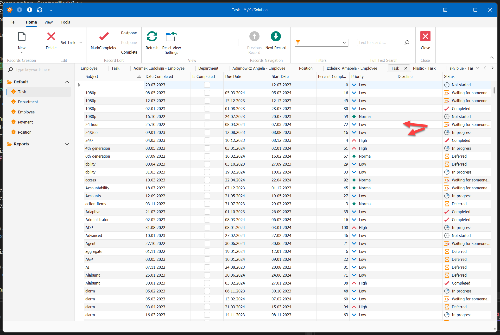
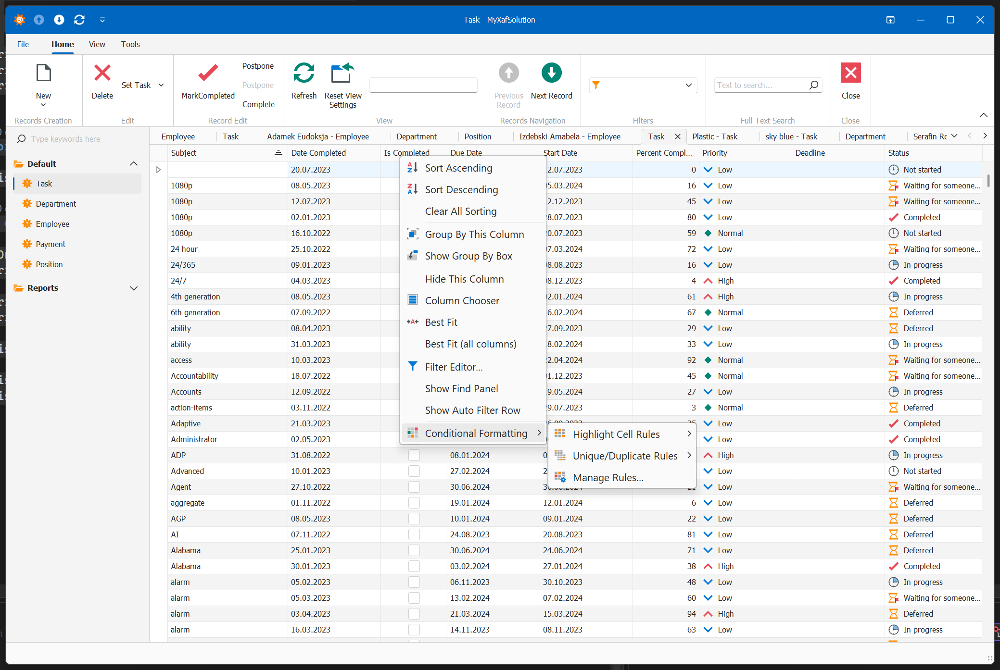
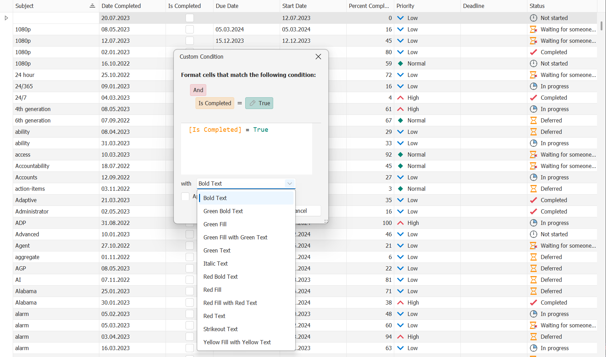

# Data Grid / List View


https://docs.devexpress.com/eXpressAppFramework/113189/ui-construction/list-editors

## Konfigurowanie DataGrid:


grid można dowolnie konfigurować, aby sie do niego dostać należy utworzyć kontroler 

https://docs.devexpress.com/eXpressAppFramework/402154/ui-construction/list-editors/how-to-access-list-editor-control

WinForms

```csharp
using DevExpress.ExpressApp;
using DevExpress.ExpressApp.Win.Editors;
using DevExpress.XtraGrid.Columns;
using DevExpress.XtraGrid.Views.Grid;
using YourApplicationName.Module.BusinessObjects;

namespace YourApplicationName.Win.Controllers;

public class GridViewController : ObjectViewController<ListView, TargetClassName> {
    protected override void OnViewControlsCreated() {
        base.OnViewControlsCreated();
        // Obtain the List Editor: XAF's abstraction over the UI control.
        if (View.Editor is GridListEditor gridListEditor && gridListEditor.GridView != null) {
            // Access the GridView object (part of the DevExpress WinForms Grid Control architecture). 
            GridView gridView = gridListEditor.GridView;
            // Specify the behavior of the grid's columns.
            // Access grid columns.
            // Use column settings to disable the sorting and grouping functionality. 
            foreach (GridColumn columnModel in gridView.Columns) {
                columnModel.OptionsColumn.AllowSort = DevExpress.Utils.DefaultBoolean.False;
                columnModel.OptionsColumn.AllowGroup = DevExpress.Utils.DefaultBoolean.False;
            }
        }
    }
}
```

Blazor:

```csharp
using DevExpress.ExpressApp;
using DevExpress.ExpressApp.Blazor.Editors;
using DevExpress.ExpressApp.Blazor.Editors.Models;
using YourApplicationName.Module.BusinessObjects;

namespace YourApplicationName.Blazor.Server.Controllers;

public class GridViewController : ObjectViewController<ListView, TargetClassName> {
    protected override void OnViewControlsCreated() {
        base.OnViewControlsCreated();
        if (View.Editor is DxGridListEditor gridListEditor) {
            // Obtain the Component Adapter.
            IDxGridAdapter dataGridAdapter = gridListEditor.GetGridAdapter();

            // Access grid property.
            dataGridAdapter.GridModel.PagerVisible = false;

            // Access grid columns.
            // Use column settings to disable the sorting and grouping functionality. 
            foreach (DxGridDataColumnModel columnModel in dataGridAdapter.GridDataColumnModels) {
                columnModel.AllowSort = false;
                columnModel.AllowGroup = false;
            }
        }
    }
}
```


### Naprzemienne kolorowanie wierszy na liście  oraz domyślne ustawienia na wszystkich listach np AutoFilter

Winforms

```csharp
    public class DataGridListViewController : ViewController<ListView>
    {

        public DataGridListViewController() : base()
        {
            ViewControlsCreated += DataGridListViewController_ViewControlsCreated;
        }

        private void DataGridListViewController_ViewControlsCreated(object sender, EventArgs e)
        {
            GridListEditor listEditor = View.Editor as GridListEditor;

            if (listEditor != null)
            {
                GridView gridView = listEditor.GridView;
                SetListView(gridView);
            }
        }

        private static void SetListView(GridView gridView)
        {
            gridView.OptionsView.EnableAppearanceOddRow = true;

            gridView.OptionsView.ShowFooter = false;
            gridView.OptionsView.GroupFooterShowMode = GroupFooterShowMode.VisibleIfExpanded;
            gridView.OptionsMenu.ShowGroupSummaryEditorItem = true;
            gridView.OptionsMenu.ShowConditionalFormattingItem = true;
            gridView.OptionsPrint.ExpandAllGroups = false;
            //  właczamy filtry pod nagłowkami
            gridView.OptionsView.ColumnAutoWidth = true;
            //  właczamy zmiane rozmiru kolumn
            gridView.OptionsView.RowAutoHeight = true;

            gridView.OptionsView.ShowAutoFilterRow = false;
            gridView.OptionsFind.AlwaysVisible = false;
            gridView.UserCellPadding = new System.Windows.Forms.Padding(0);
            gridView.OptionsView.ShowFilterPanelMode = DevExpress.XtraGrid.Views.Base.ShowFilterPanelMode.Default;
        }

        protected override void OnActivated()
        {
            base.OnActivated();
            // Perform various tasks depending on the target View.
        }
        protected override void OnDeactivated()
        {
            // Unsubscribe from previously subscribed events and release other references and resources.
            base.OnDeactivated();
        }
        protected override void OnViewControlsCreated()
        {
            base.OnViewControlsCreated();
            // Access and customize the target View control.
        }
    }
```




Blazor

```csharp
    public class DataGridListViewController : ViewController<ListView>
    {
        protected override void OnViewControlsCreated()
        {
            base.OnViewControlsCreated();
            if (View.Editor is DxGridListEditor gridListEditor)
            {
                var dataGridAdapter = gridListEditor.GetGridAdapter();
                dataGridAdapter.GridModel.CssClass += " grid-striped";
                dataGridAdapter.GridModel.ColumnResizeMode = GridColumnResizeMode.ColumnsContainer;
                dataGridAdapter.GridModel.ShowFilterRow = true;
                dataGridAdapter.GridModel.PageSizeSelectorVisible = true;

                foreach (var column in gridListEditor.Columns)
                {
                    if (column.Width < 80)
                    {
                        column.Width = 80;
                    }
                }
            }
        }
    }
```

### Zaznaczanie wierszy checkboxem (WinForms)

Można to bylo zrobic w kontrolerze dla wszystkich list, ale checbox na listach nie jest standardem w Windows i lepiej nie korzystać z tej opcji wszędzie tylko faktycznie gdzie jest potrzebne. Dodatkowo pojawiają sie tam 2 drobne problemy :

1. Grid automatycznie oznacza pierwszy wiersz jako wybrany, co często przeszkadza, wiec trzeba odznaczyć rekordy :  `gridListEditor.GridView.ClearSelection();`
2. Przestaje dzialac double clik na liscie i nie otwiera rekordu, wiec trezba dodac:  `listViewProcessCurrentObjectController.ProcessCurrentObjectAction.SelectionDependencyType = SelectionDependencyType.Independent;`

```csharp

    public class CheckBoxRowSelectController : ObjectViewController<ListView,Employee>
    {
        GridListEditor gridListEditor;
        ListViewProcessCurrentObjectController listViewProcessCurrentObjectController;
        protected override void OnViewControlsCreated()
        {
            base.OnViewControlsCreated();
            gridListEditor = View.Editor as GridListEditor;
            if (gridListEditor != null)
            {
                listViewProcessCurrentObjectController = Frame.GetController<ListViewProcessCurrentObjectController>();
                if (listViewProcessCurrentObjectController != null)
                {
                    listViewProcessCurrentObjectController.ProcessCurrentObjectAction.SelectionDependencyType = SelectionDependencyType.Independent;
                }
                gridListEditor.ControlDataSourceChanged += GridListEditor_ControlDataSourceChanged;
                gridListEditor.GridView.OptionsBehavior.EditorShowMode = EditorShowMode.MouseDown;
                gridListEditor.GridView.OptionsSelection.MultiSelectMode = GridMultiSelectMode.CheckBoxRowSelect;
            }
        }
        private void GridListEditor_ControlDataSourceChanged(object sender, EventArgs e)
        {
            gridListEditor.GridView.ClearSelection();
        }
        protected override void OnDeactivated()
        {
            base.OnDeactivated();
            if (gridListEditor != null)
            {
                gridListEditor.ControlDataSourceChanged -= GridListEditor_ControlDataSourceChanged;
                gridListEditor = null;
            }
            if (listViewProcessCurrentObjectController != null)
            {
                listViewProcessCurrentObjectController.ProcessCurrentObjectAction.SelectionDependencyType = SelectionDependencyType.RequireSingleObject;
                listViewProcessCurrentObjectController = null;
            }
        }
    }
```


## 


## Zapamiętywanie ustawień warunkowych (Tylko WinForms) 


Grid w winform ma świetny mechanizm kolorowania warunkowego wierszy czy pojedynczych komórek:






Wadą jego jest jednak to, ze nie jest zapamiętywany. Nie mniej jednak można to dołożyć:

```csharp
   public class GridFormatRulesStoreController : ViewController<ListView>, IModelExtender
    {
        GridFormatRulesStore formatRulesStore = null;
        GridListEditor gridListEditor = null;
        protected override void OnActivated()
        {
            base.OnActivated();
            gridListEditor = View.Editor as GridListEditor;
            if (gridListEditor != null)
            {
                View.ControlsCreated += View_ControlsCreated;
                View.ModelSaved += View_ModelSaved;
            }
        }
        void View_ControlsCreated(object sender, EventArgs e)
        {
            InitializeFormatRules();
        }
        private void InitializeFormatRules()
        {
            gridListEditor.GridView.OptionsMenu.ShowConditionalFormattingItem = true;
            formatRulesStore = new GridFormatRulesStore();
            formatRulesStore.FormatRules = gridListEditor.GridView.FormatRules;
            formatRulesStore.Restore(((IModelListViewGridFormatRuleSettings)View.Model).GridFormattingSettings);
        }
        void View_ModelSaved(object sender, EventArgs e)
        {
            ((IModelListViewGridFormatRuleSettings)View.Model).GridFormattingSettings = formatRulesStore.Save();
        }
        protected override void OnDeactivated()
        {
            if (gridListEditor != null)
            {
                View.ModelSaved -= View_ModelSaved;
                View.ControlsCreated -= View_ControlsCreated;
                gridListEditor = null;
            }
            base.OnDeactivated();
        }
        public void ExtendModelInterfaces(ModelInterfaceExtenders extenders)
        {
            extenders.Add<IModelListView, IModelListViewGridFormatRuleSettings>();
        }
    }
    public interface IModelListViewGridFormatRuleSettings
    {
        [Browsable(false)]
        string GridFormattingSettings { get; set; }
    }
    //Dennis: This is a modified version of the solution given at 
   // https://www.devexpress.com/Support/Center/Question/Details/T289562 that can save/load settings into/from a string.
    internal class GridFormatRulesStore : IXtraSerializable
    {
        GridFormatRuleCollection formatRules;
        [DesignerSerializationVisibility(DesignerSerializationVisibility.Content), Browsable(true),
         XtraSerializableProperty(XtraSerializationVisibility.Collection, true, false, true, 1000, XtraSerializationFlags.DefaultValue)]
        public virtual GridFormatRuleCollection FormatRules
        {
            get { return formatRules; }
            set { formatRules = value; }
        }
        public string Save()
        {
            using (MemoryStream stream = new MemoryStream())
            {
                SaveCore(new XmlXtraSerializer(), stream);
                return Convert.ToBase64String(stream.GetBuffer());
            }
        }
        public void Restore(string settings)
        {
            if (!string.IsNullOrEmpty(settings))
            {
                using (MemoryStream stream = new MemoryStream(Convert.FromBase64String(settings)))
                {
                    RestoreCore(new XmlXtraSerializer(), stream);
                }
            }
        }
        void SaveCore(XtraSerializer serializer, object path)
        {
            Stream stream = path as Stream;
            if (stream != null)
                serializer.SerializeObject(this, stream, GetType().Name);
            else
                serializer.SerializeObject(this, path.ToString(), GetType().Name);
        }
        void RestoreCore(XtraSerializer serializer, object path)
        {
            Stream stream = path as Stream;
            if (stream != null)
                serializer.DeserializeObject(this, stream, GetType().Name);
            else
                serializer.DeserializeObject(this, path.ToString(), GetType().Name);
        }
        void XtraClearFormatRules(XtraItemEventArgs e) { FormatRules.Clear(); }
        object XtraCreateFormatRulesItem(XtraItemEventArgs e)
        {
            var rule = new GridFormatRule();
            formatRules.Add(rule);
            return rule;
        }
        #region IXtraSerializable
        public void OnEndDeserializing(string restoredVersion) { }
        public void OnEndSerializing() { }
        public void OnStartDeserializing(LayoutAllowEventArgs e) { }
        public void OnStartSerializing() { }
        #endregion
    }

```

